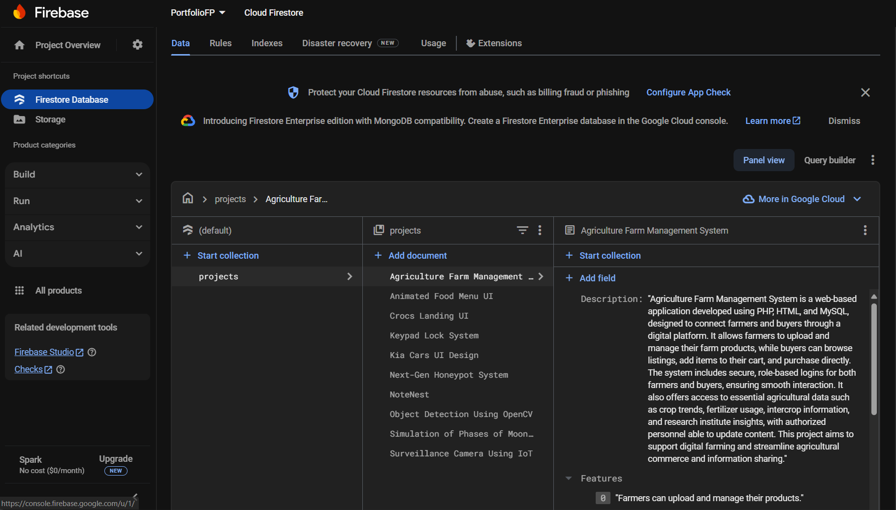
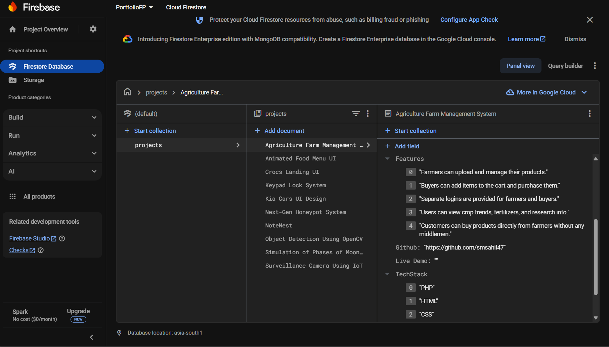

# 💼 Portfolio Website – Shaikh Mohammed Sahil

Hello everyone!  
Let me introduce myself – I’m **Shaikh Mohammed Sahil**.  
On this occasion, I’d like to share **my portfolio website project**, which showcases my skills, experience, and projects in a highly interactive and beautifully animated UI.

---

## 🚀 Tech Stack Used

- ReactJS  
- Tailwind CSS  
- AOS (Animate On Scroll)  
- Firebase  
- Framer Motion  
- Lucide Icons  
- Material UI  
- SweetAlert2  

---

## 🌐 Website Link

www.smsahil.site 

---

## 🙏 Credits

This project is based on the incredible work by **Eki Zulfar Rachman**.  
I cloned and customized the original repository:  
🔗 [https://github.com/EkiZR/Portofolio_V5](https://github.com/EkiZR/Portofolio_V5)

I truly appreciate him for creating such an excellent portfolio using React and Tailwind CSS.

---

## 🧑‍💻 How to Run This Project

### ✅ Prerequisites

Ensure that you have the following installed:

- **Node.js**

---

### 📦 Steps to Run Locally

**1. Clone this repository:**

```bash
git clone https://github.com/smsahil47/my-portfolio.git
```

**2. Navigate to the project directory:**

```bash
cd my-portfolio
```

**3. Install all dependencies:**

```bash
npm install
```

> If you face dependency issues, use:
```bash
npm install --legacy-peer-deps
```

**4. Start the development server:**

```bash
npm run dev
```

**5. Open the app in your browser:**

Visit the link shown in your terminal, usually `http://localhost:5173/`.

---

## 📦 Production Build

To generate a production-ready build:

```bash
npm run build
```

This will create a `dist` folder containing optimized files for deployment.

You can upload this folder to your hosting service (like Vercel, Netlify, Firebase Hosting, etc.).

---

## 🔥 Firebase Configuration

If you're using Firebase as a backend:

### 1. **Add Firebase to Your Project**

- Go to [Firebase Console](https://console.firebase.google.com/)
- Create a new project or select an existing one

### 2. **Enable Firestore Database**

- Navigate to `Firestore Database` > `Create Database`

### 3. **Configure Firebase in Code**

- Go to `Project Settings` > Scroll down to **Your apps** > Copy the Firebase config
- Replace the configuration in your `firebase.js` or equivalent file

```javascript
// Example structure
const firebaseConfig = {
  apiKey: "YOUR_API_KEY",
  authDomain: "YOUR_AUTH_DOMAIN",
  projectId: "YOUR_PROJECT_ID",
  storageBucket: "YOUR_STORAGE_BUCKET",
  messagingSenderId: "YOUR_SENDER_ID",
  appId: "YOUR_APP_ID"
};
```

### 4. **Set Firebase Rules**

Go to **Firestore Database > Rules** and temporarily set:

```
rules_version = '2';
service cloud.firestore {
  match /databases/{database}/documents {
    match /{document=**} {
      allow read, write: if true;
    }
  }
}
```

> ⚠️ For development only! Update your rules before production deployment.

### 5. **Set Up the Correct Collection Structure**

- Set up the collections as shown in the following images:






---

### 6. **Update firebase.js and firebase-comment.js Files**:

- Replace the firebaseConfig content with your Firebase configuration.


## 🔍 Notes

If you encounter issues while running the project, ensure that:

- ✅ Node.js is correctly installed and up to date  
- 📁 You’re in the correct project directory (`my-portfolio`)  
- 📦 All dependencies are installed **without errors** (`npm install`)  
- 🌐 Your internet connection is stable (for dependency installation and Firebase operations)  
- 🔐 Firebase is properly configured with valid credentials in your `firebase.js`  
- 🔥 Firestore rules are temporarily set to allow read/write during development

---

## 🧾 License

This project is for **educational and personal use** only.  
If you use or adapt it, please give proper **credit to [Eki Zulfar Rachman](https://github.com/EkiZR)**.

---

Made with ❤️ by **Shaikh Mohammed Sahil**
